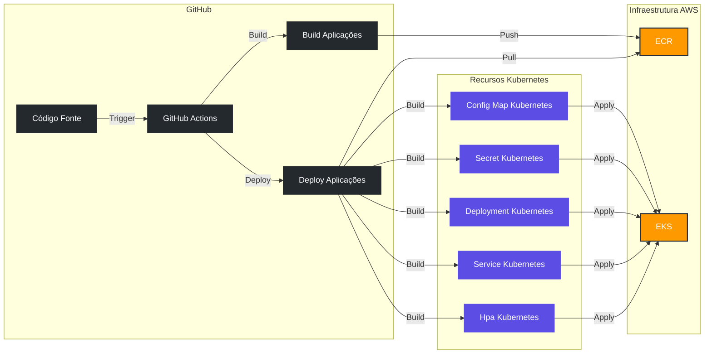

## Descrição

O projeto visa desenvolver um sistema de autoatendimento para uma lanchonete em expansão que está enfrentando desafios no controle de pedidos. O sistema gerenciará todo o fluxo, desde o pedido inicial até a entrega, incluindo:

- Autoatendimento com identificação opcional do cliente
- Gestão de pedidos
- Acompanhamento em tempo real do status do pedido
- Gerenciamento administrativo de produtos, clientes e pedidos
- Gestão de pagamentos(Implementação posterior a versão 1.0.0)

## Fluxo de Dados

1. **Cliente faz pedido** :
   * Seleção de produtos.
   * Identificação (opcional).
   * Pagamento via QRCode.
2. **Sistema processa pedido** :
   * Atualiza o status para "Recebido".
   * Notifica a cozinha para preparação.
3. **Cozinha prepara o pedido** :
   * Atualiza o status para "Em preparação".
4. **Pedido finalizado** :
   * Atualiza o status para "Pronto".
   * Notifica o cliente.
5. **Cliente retira o pedido** :
   * Atualiza o status para "Finalizado".

## Arquitetura

Detalhes gerais sobre a arquitetura do projeto estão disponíveis nesse link: [Sistema de Autoatendimento da Lanchonete](docs/architecture-haiku.md)

## Diagrama de Fluxo de CI/CD

A construção e implantação dos serviços é realizada através de através de workflows do GitHub Actions.



## Plugins do VSCode para Desenvolvimento

Para uma experiência de desenvolvimento mais produtiva recomendamos os seguintes plugins do VSCode:

- [GitLens](https://marketplace.visualstudio.com/items?itemName=eamodio.gitlens): Integração Git aprimorada com histórico de linha e navegação avançada.
- [YAML](https://marketplace.visualstudio.com/items?itemName=redhat.vscode-yaml): Suporte para arquivos YAML (útil para configurações do GitHub Actions).
- [GitHub Actions](https://marketplace.visualstudio.com/items?itemName=GitHub.vscode-github-actions): Suporte para sintaxe dos workflows do GitHub Actions.

## Pré-requisitos

Antes de começar, você vai precisar ter instalado em sua máquina:

- .Net 8
- Para sistema operacional Windows: WSL2
- Docker e Docker Compose
- Kubernetes instalado localmente ([minikube](https://minikube.sigs.k8s.io/) ou [kind](https://kind.sigs.k8s.io/))

## Instruções para iniciar o projeto localmente

Siga os passos abaixo para rodar o projeto na sua máquina:

1 - Execute do docker compose para orquestrar o inicio da aplicação com o banco de dados à partir ddo diretório raiz da aplicação

```bash
docker-compose up --build
```

2 - Após validar que a aplicação subiu sem erros, acessar a seguinte url no browser para listagem do swagger de todos os endpoints disponíveis:

[http://localhost:8080/swagger](http://localhost:8080/swagger)

### Outros comandos

- Para cenários onde for necessário eliminar as instâncias dos conteiners da aplicação incluindo o processo de reiniciar o banco de dados ou limpar os dados iniciais carregados executar o seguinte comando:

```bash
docker-compose down --volumes
```

## Rodando com o Kubernetes

1 - Pré-requisitos:

- Verifique se você possui o kubectl instalado e configurado

```bash
kubectl version
```

- Certifique-se de ter um cluster Kubernetes disponível (via Minikube, GKE, AKS, DockerHub, etc...)

```bash
kubectl cluster-info
```

2 - Aplicar as configurações no Kubernetes:
Primeiramente, você precisará aplicar os manifests YML do Kubernetes (Deployment, Service, ConfigMap, etc.).
No diretório do projeto, execute o script para aplicar as configurações:

```bash
./deploy.sh
```

3 - Valide que tudo funcionou sem problemas com os comandos:

```bash
kubectl get all
```

Com esse comando é possível visualizar todos os recursos disponíveis e os seus status.

4 - Após validar que a aplicação subiu sem erros, acessar a seguinte url no browser para listagem do swagger de todos os endpoints disponíveis:

[http://localhost:30000/swagger](http://localhost:30000/swagger)

### Outros comandos kubectl interessantes:

```bash
kubectl delete pvc postgres-pvc # Exclui o pvc caso ocorra algum problema com as tabelas do banco
kubectl delete pod -l app=fiap-tech-challenge # Exclui o pod para forçar a criação de um novo pod
kubectl exec -it <nome_do_pod> -- psql -U fiap_user -d fiap_db -c "\dt" # Para visualizar as tabelas criadas
kubectl get pods --watch # Visualizar o status dos pods em tempo real
kubectl logs fiap-tech-challenge # Visualizar os logs do pod da aplicação
```

## APIs disponibilizadas

### Swagger

Após subir a aplicação as documentações do swagger serão disponibilizadas nos seguinte links:

| Serviço | Docker                        | Kubernetes                     |
| ---------- | ------------------------------- | -------------------------------- |
| API      | http://localhost:8080/swagger | http://localhost:30000/swagger |
| Webhook  | http://localhost:8082/swagger | http://localhost:30002/swagger |

### Postman

- [Collection](postman/FIAP%20-%20Tech%20Challenge%20-%20Fase%202%20-%20APIs.postman_collection.json)
- [Environment - Desenvolvimento](postman/TC%20-%20Desenvolvimento.postman_environment.json)
- [Environment - Docker](postman/TC%20-%20Docker.postman_environment.json)
- [Environment - Kubernetes](postman/TC%20-%20Kubernetes%20Local.postman_environment.json)
