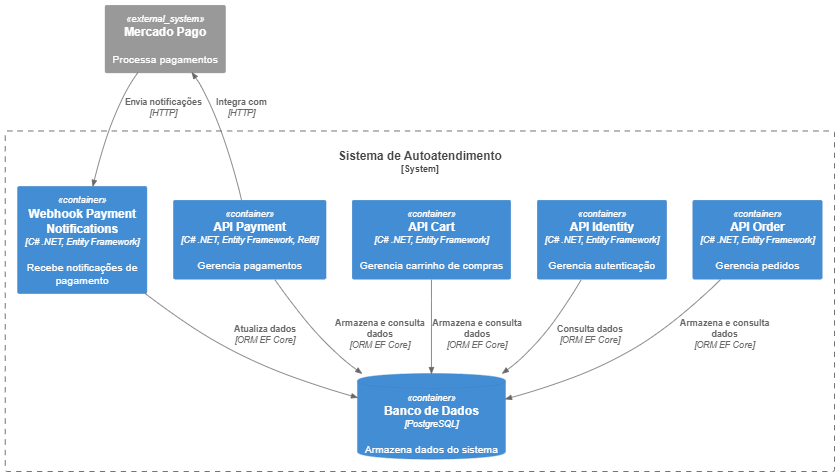

# Sistema de Autoatendimento da Lanchonete

## 1. Objetivo

Descrever a arquitetura do sistema de autoatendimento, que visa melhorar a eficiência do atendimento ao cliente e a gestão de pedidos na lanchonete, com foco em escalabilidade, segurança e organização do código.




## 1.1 Escopo

* Sistema de autoatendimento para clientes.
* Painel administrativo para a gestão de pedidos e produtos.
* Infraestrutura baseada em Kubernetes.
* Implementação de Clean Architecture nas APIs.

## 2. Componentes Principais

### 2.1 APIs do Cliente

* **Seleção de Pedidos** : Interface para seleção de lanche, acompanhamento e bebida.
* **Identificação do Cliente** : Opções de identificação via CPF, nome ou não identificação.
* **Pagamento** : Integração com QRCode do Mercado Pago.
* **Acompanhamento de Pedidos** : Exibição do status do pedido em tempo real.

### 2.2 APIs Administrativas

* **Gerenciamento de Produtos** : Adição, edição e remoção de produtos, com descrição e imagens.
* **Acompanhamento de Pedidos** : Monitoramento de pedidos em andamento e tempo de espera.

## 3. Fluxo de Dados

1. **Cliente faz pedido** :
   * Seleção de produtos.
   * Identificação (opcional).
   * Pagamento via QRCode.
2. **Sistema processa pedido** :
   * Atualiza o status para "Recebido".
   * Notifica a cozinha para preparação.
3. **Cozinha prepara o pedido** :
   * Atualiza o status para "Em preparação".
4. **Pedido finalizado** :
   * Atualiza o status para "Pronto".
   * Notifica o cliente.
5. **Cliente retira o pedido** :
   * Atualiza o status para "Finalizado".

## 4. Requisitos Funcionais

* O sistema deve permitir a personalização de pedidos.
* O sistema deve oferecer checkout do pedido com opção de pagamento através QRCode gerado no Mercado Pago.
* O sistema deve permitir acompanhamento em tempo real do status do pedido.
* O sistema deve oferecer opção para acompanhamento do status de pagamento do pedido.

## 5. Requisitos Não Funcionais

### 5.1 Desempenho

* **Kubernetes** : Utilizar Kubernetes para orquestração de containers, permitindo a escalabilidade e gestão eficiente dos serviços.

### 5.2 Escalabilidade

* **HPA (Horizontal Pod Autoscaler)** : Utilização do HPA para cada Deployment que utiliza métricas de CPU e memória para escalar automaticamente o número de Pods baseando-se na demanda.

### 5.3 Segurança

* **ConfigMap e Secrets**: Utilização de ConfigMaps para armazenar configurações não sensíveis e Secrets para dados sensíveis (como credenciais de banco de dados e chaves de API), garantindo que  informações confidenciais não sejam expostas no código fonte.

## 6. Clean Architecture

A Clean Architecture foi selecionada para o desenvolvimento do sistema pois traz uma abordagem de desenvolvimento de software que visa criar sistemas mais robustos, escaláveis e de fácil manutenção. Suas principais motivações incluem:

* **Manutenção facilitada:** Código organizado e legível, facilitando a implementação de mudanças.
* **Complexidade reduzida:** Estrutura em camadas com responsabilidades específicas, tornando o sistema mais compreensível.
* **Alta qualidade do código:** Aplicação dos princípios SOLID e práticas recomendadas, reduzindo bugs e facilitando testes.
* **Evolução facilitada:** Estrutura modular permite adicionar novas funcionalidades de forma ágil.
* **Independência de tecnologias:** Módulos de alto nível desacoplados de módulos de baixo nível, permitindo adaptação a novas tecnologias.
* **Colaboração aprimorada:** Código bem estruturado facilita o trabalho em equipe.

### 6.1 Camadas

* **API:** Camada de implementação os endpoints da aplicação responsáveis pela gestão de pedidos, pagamentos, produtos e clientes.
* **Webhook:** Camada de implementação dos webhooks responsáveis por receber respostas dos serviços de pagamento do sistema.
* **Application**

  * **Common/:** Armazena classes e interfaces compartilhadas.
    * **Daos/:** Objetos de acesso a dados.
    * **Dtos/:** Objetos de transferência de dados.
    * **Interfaces/:** Definições de interfaces.
  * **Controllers/:** Controladores da API.
  * **Entities/:** Classes que representam as entidades do domínio.
  * **Gateways/:** Implementações de gateways para comunicação com serviços externos.
  * **Presenters/:** Classes para formatar dados para apresentação.
  * **UseCases/:** Implementações dos casos de uso da aplicação.
* **Infraestructure**

  * **ExternalServices/:** Armazena os serviços externos utilizados pelo projeto.
  * **Persistence/:** Lida com a persistência de dados.
    * **Context/:** Contém o contexto do Entity Framework Core para acesso ao banco de dados.
    * **EntityTypeConfigurations/:** Define as configurações das entidades do banco de dados.
    * **Repositories/:** Implementa os padrões de repositório para acesso aos dados.

### 6.2 Exemplo de Estrutura

```
API/
Webhook/
Application/
├── Common/
│   ├── Daos/
│   ├── Dtos/
│   ├── Interfaces/
├── Controllers/
│   ├── OrderController.cs
├── Entities/
│   ├── Order.cs
├── Gateways/
│   ├── OrderGateway.cs
├── Presenters/
│   ├── OrderPresenter.cs
├── UseCases/
│   ├── CreateOrderUseCase.cs
Infrastructure/
├── bin/
├── ExternalServices/
│   ├── ExternalService.cs
└── Persistence/
    ├── Context/
    ├── EntityTypeConfigurations/
    └── Repositories/
```

## 7. Tecnologias utilizadas

* **Backend (Apis e Webhooks)**
  * **Framework:** .NET 8 devido a maior longeviade de suporte da Microsoft. Referência: [.Net Support Policy](https://dotnet.microsoft.com/en-us/platform/support/policy)
  * **ORM**: Entity Framework.
  * **Injeção de Dependência**: `Microsoft.Extensions.DependencyInjection`.
  * **Documentação**: Swagger/OpenAPI.
* **Validação** : FluentValidation.
* **Banco de Dados**: PostgreSQL.
* **Docker:** Utilizado para containerização da aplicação.
* **Docker Compose**: Utilizado para permitir a execução da aplicação localmente com orquestração da execução e inicialização do banco de dados local já sendo populado com alguns dados para permitir a execução da aplicação.
* **Kubernetes** : Para orquestração e gerenciamento de containers.
